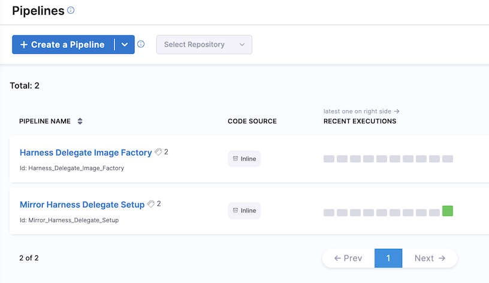
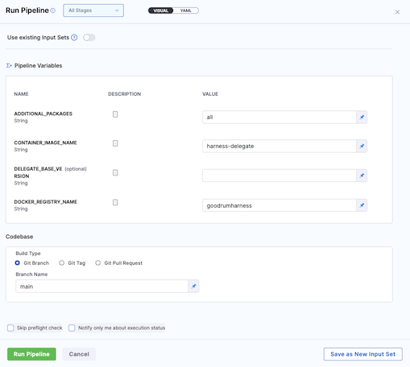
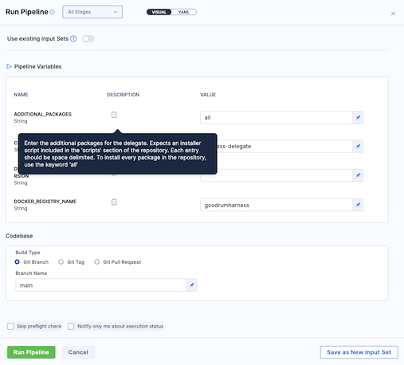

# Harness Delegate Image Factory - Post-Deployment Guide
Learn how to use the deployed Solutions Factory

## What has been deployed?
---
- A new Pipeline used to create and customize Harness Delegate Images with support for:
    - Dynamically determining the latest Harness Delegate version
    - Optional integration with supported Harness Security Test Orchestration (STO) container image scans
    - Optional integration with Harness Software Supply Chain Assurance (SSCA) to generate a Software Bill of Materials (SBOM)
- Optional Harness Code Repository to house the custom Harness Delegate image scripts and Dockerfile
- Optional Pipeline used to synchronize and mirror code repository from Harness into Harness Code Repository

## Build new custom delegate images

***Note**: If you chose to not use the Harness Source Code Repository option, you will need to ensure that the repostory has been created in your SCM environment and loaded prior to proceeding*

### Step One - Start the Pipeline - *Harness Delegate Image Factory*

Navigate to the project ***Delegate Management*** located in the ***Harness Platform Administration*** project. A new pipeline has been added to this project ***Harness Delegate Image Factory***

***Note**: The pipeline **Mirror Harness Delegate Setup** will only exist when using Harness Code Repositories*

### Step Two - Start the Pipeline - *Harness Delegate Image Factory*

Click the three-dot menu and choose **RUN** to launch the pipeline

***Note**: The pipeline **Mirror Harness Delegate Setup** will only exist when using Harness Code Repositories*

### Step Three - Adjust settings before starting the pipeline

The pipeline variable *`ADDITIONAL_PACKAGES`* can be used to customize the installer_scripts included and installed in the image. By default, the pipeline will use the *`all`* keyword which installs all packages included in the repository.

## How do I control what is built into the image
---
Inside the `docker` directory within the Code Repository are three directories
- **scripts** : Contains installer scripts in which the filename is `install_<tool>.sh` and contains necessary steps to prepare, dowload, and install the tools
- **certificates** : This directory can be used to store custom certificate bundles into the custom delegate
- **java_truststore** : This directory can be used to store custom java truststore into the custom delegate
