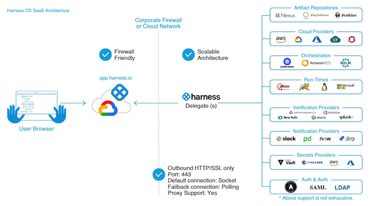

# Harness Delegate Image Factory
Harness Solutions Factory for delegate image creation and management

## Getting Started
Ready to jump right in? [Checkout the Step-by-Step guide](walkthru.md)

## Why would I want to customize my delegate?
During Continuous Delivery Deployments, the Harness Delegate plays a vital role in the deployment process and often requires certain tools and binaries to be installed. Additionally, most enterprises prefer to have their container images be immutable and self-managed.  The purpose of this solution is to provide Harness customers with a way to manage the creation of their own Delegate images and an automated way to manage the lifecycle of the images.

- Delegate provides INIT_SCRIPT but is not recommended to support immutable delegate
- Customers do not want to auto upgrade and would prefer to scan and validate first.
- Customers do not allow images from public repo and have to push the image to private registry.
- Harness releases delegate with new features and fixes frequently. Managing this manually is very time consuming and error prone. Using HSF makes this automated and robust.

## What is included?
The Harness Delegate Image Factory is a robust Harness pipeline designed to create and manage the lifecycle of customized Harness Delegate Images. This template will build and deliver the following:

- A new Pipeline used to create and customize Harness Delegate Images with support for:
  - Dynamically determining the latest Harness Delegate version
  - Optional integration with supported Harness Security Test Orchestration (STO) container image scans
  - Optional integration with Harness Software Supply Chain Assurance (SSCA) to generate a Software Bill of Materials (SBOM)
- Optional Harness Code Repository to house the custom Harness Delegate image scripts and Dockerfile

## What is a Harness Delegate

Harness Delegate is a service you run in your local network or VPC to connect your artifacts, infrastructure, collaboration, verification, and other providers with Harness Manager. The first time you connect Harness to a third-party resource, Harness Delegate is installed in your target infrastructure, for example, a Kubernetes cluster. After the delegate is installed, you connect to third-party resources. The delegate performs all operations, including deployment and integration.

## How do I size my Delegates?

| Replicas | Required memory / CPU | Maximum parallel deployments and builds across replicas |
| --- | --- | --- |
| 1 | 2 GB / 0.5 CPU | 10|
| 2 | 4 GB / 1 CPU | 20|
| 4 | 8 GB / 2 CPU | 40|
|8 | 16 GB / 4 CPU | 80|

## Learn More about Harness Delegates
https://developer.harness.io/docs/platform/delegates/delegate-concepts/delegate-overview/

