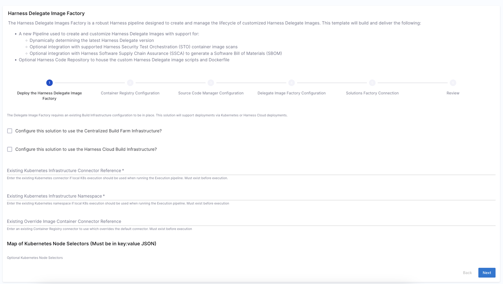
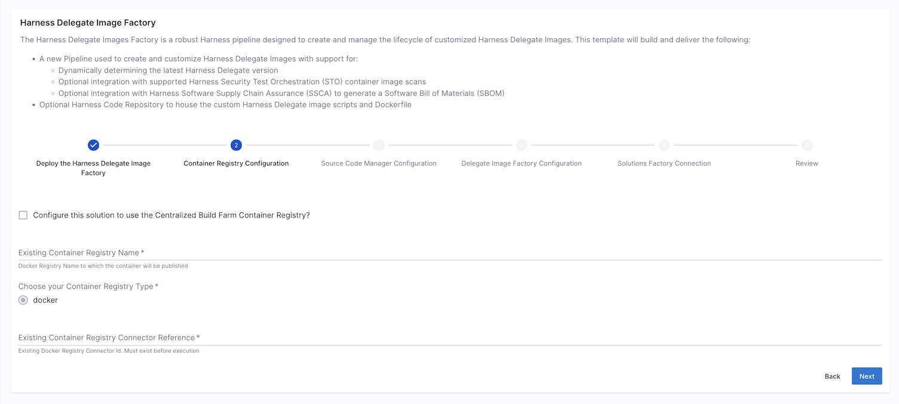
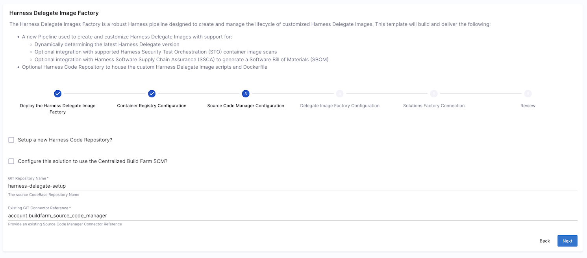
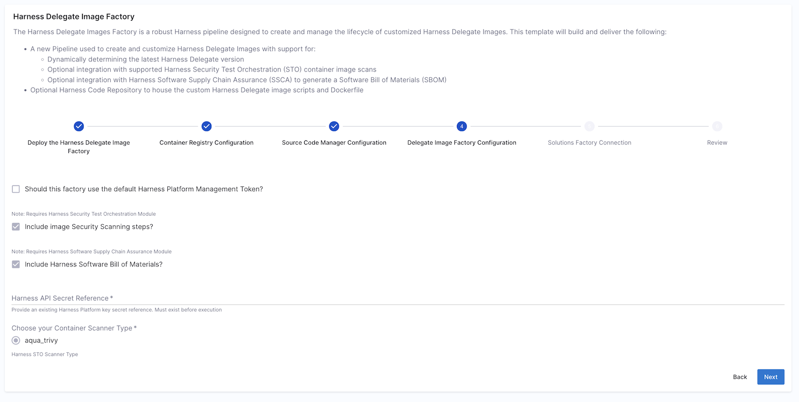
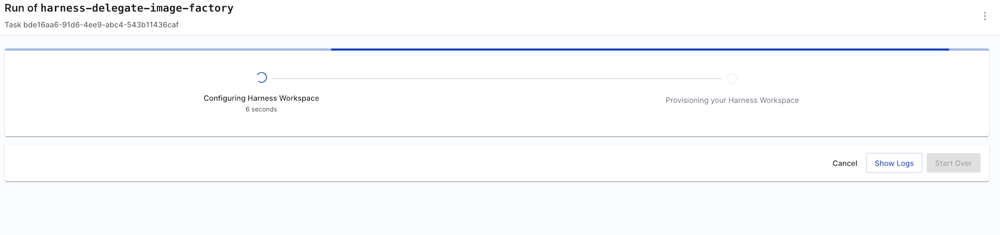
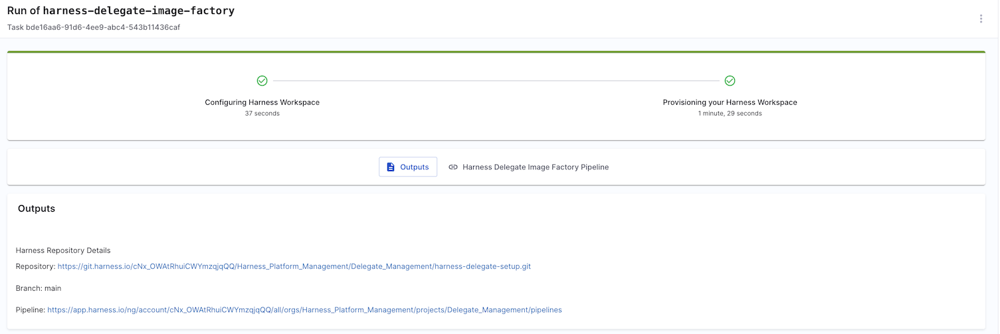

# Harness Delegate Image Factory - Walk-Thru
Step-by-Step guide to using this template

## Where will things be deployed?
This workflow will automatically be added to the Harness Solutions Factory Project labeled `Delegate Management` located in the `Harness Platform Management` Organization

## Pre-requisites
Prior to running this template, it is advised that you prepare the Harness Account by running the Workflow - `Harness Central Build Farm Setup`. This workflow can be configured to use the account level build-farm connectors created by that Workflow.

***Note**: If not using Harness Code Repositories, you will be required to clone the remote repository containing the Dockerfile and scripts needed to build the image. This is required prior to the subsequent execution of the pipeline created by this workflow. If using Harness Code, this Workflow will pull and seed that deployment repository for you*

## Step-by-Step

### Step One - Build Infrastructure
First begin by choosing your Build Infrastructure type.

- Select **Configure this solution to use the Centralized Build Farm Infrastructure?** to use the Central Build Farm infrastructure connector: This option will configure the deployed pipeline to use the defined Build Farm Infrastructure.

- Select **Configure this solution to use the Harness Cloud Build Infrastructure?** to leverage Harness Cloud Builds. This is a licensed feature that needs to be enabled for your account. With Harness Cloud, you can run builds in isolation on Harness-managed VMs that are preconfigured with tools, packages, and settings commonly used in CI pipelines. Harness hosts, maintains, and upgrades these machines so that you can focus on building software instead of maintaining build infrastructure.

- Bring your own Build Farm infrastructure setup. This option expects that you have an existing connector created and configured. ***Note**: When providing the connector reference, you will need to include the hierarchy reference (account.ID or org.ID)*



### Step Two - Artifact Manager
Now, let's configure the Container Registry to which the new delegate image will be deployed.

- Select **Configure this solution to use the Centralized Build Farm Container Registry?** to use the Central Build Farm container registry connector: This option will configure the deployed pipeline to use the defined Build Farm Container Registry.

- Bring your own Build Farm container registry setup. This option expects that you have an existing connector created and configured. ***Note**: When providing the connector reference, you will need to include the hierarchy reference (account.ID or org.ID)*

Both options will require `Existing Container Registry Name` to be provided. This will be the repository into which the new delegate image will be deployed.




### Step Three - Source Code Manager
Once the container registry target has been selected, we will need to identify where the code repository will be stored.

- Select **Setup a new Harness Code Repository?** to leverage the Harness Source Code Module built into the plaftorm. When this option is chosen, the source code repository will be created and imported automatically as part of the execution.

- Select **Configure this solution to use the Centralized Build Farm SCM?** to use the use the Central Build Farm SCM connector: This option will configure the deployed pipeline to use the defined Build Farm Source Code Manager connector.

- Bring your own Build Farm source code connector setup. This option expects that you have an existing connector created and configured. ***Note**: When providing the connector reference, you will need to include the hierarchy reference (account.ID or org.ID)*

If not using the Harness Code Repository option, you will need to provide the `GIT Repository Name` based on the repository structure for your connector.  By default, we suggest using the name listed in the path though the actual organization or project name for the repository might be required depending on how the connector is configured. e.g When the connector is configured for the base URL of `https://github.com` then the repository name provided should be `<your-github-org>/harness-delegate-setup`



### Step Four - Security Scanners and Controls
Final configuration options and we are nearly ready to deploy the factory.

This Factory connects to your Harness Account via an API-Key to determine the most recent version of the delegate image as published by Harness. By default, the factory leverages the Harness Solutions Factory managed API token.

- Select **Should this factory use the default Harness Platform Management Token?** to allow the Factory to use the Harness Solutions factory managed token. Otherwise, you can deselect and provide your own Harness Secret reference containing this key.
***Note**: When providing the connector reference, you will need to include the hierarchy reference (account.ID or org.ID)*

- Select **Include image Security Scanning steps?** to have the container image automatically scanned by one of the supported container scanners.
***Note**: Requires that the Harness Security Test Orchestration Module is licensed and enabled on the account*

- Select **Include Harness Software Bill of Materials?** to have an SBOM of the resulting container image created.
***Note**: Requires that the Harness Software Supply Chain Assurance Module is licensed and enabled on the account*



### Step Five - Solutions Factory Details
Verify the Solutions Factory details and Review the deployment. Once satisfied that everything is created, click create to begin the deployment.

The process will generally take 1-2mins to complete



### Next Steps - Build your custom delegate image
Upon completion, everything is setup and ready for deployment

***Note**: If you chose to not use the Harness Source Code Repository option, you will need to ensure that the repostory has been created in your SCM environment and loaded.*

You may download a copy of the source code repository from the Harness ISE team. [Harness Delegate Setup Repository](https://app.harness.io/ng/account/AM8HCbDiTXGQNrTIhNl7qQ/all/code/orgs/repos/projects/hsf/repos/harness-delegate-setup)

#### Local Clone Steps
Open your terminal and navigate to the location inwhich you would like to locally store this repository.
```
git clone https://git.harness.io/AM8HCbDiTXGQNrTIhNl7qQ/repos/hsf/harness-delegate-setup.git
cd harness-delegate-setup
# Retain the original remote as `hsf` to allow for easier retrieval from Harness for updates
git remote rename origin hsf
git remote add origin <your-git-repository>
git push origin main
```



